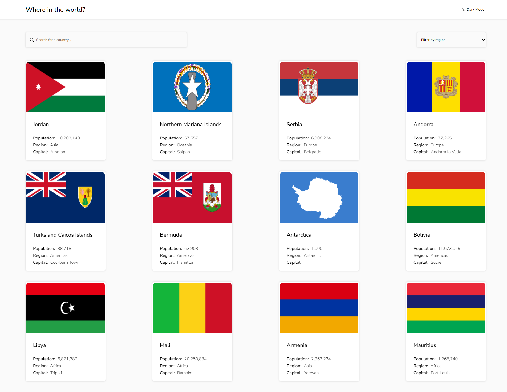

# Frontend Mentor - REST Countries API with color theme switcher solution

This is a solution to the [REST Countries API with color theme switcher challenge on Frontend Mentor](https://www.frontendmentor.io/challenges/rest-countries-api-with-color-theme-switcher-5cacc469fec04111f7b848ca). Frontend Mentor challenges help you improve your coding skills by building realistic projects. 

## Table of contents

- [Overview](#overview)
  - [The challenge](#the-challenge)
  - [Screenshot](#screenshot)
  - [Links](#links)
- [My process](#my-process)
  - [Built with](#built-with)
  - [What I learned](#what-i-learned)
  - [Continued development](#continued-development)
  - [Useful resources](#useful-resources)
- [Author](#author)

## Overview

### The challenge

Users should be able to:

- See all countries from the API on the homepage
- Search for a country using an `input` field
- Filter countries by region
- Click on a country to see more detailed information on a separate page
- Click through to the border countries on the detail page
- Toggle the color scheme between light and dark mode *(optional)*

### Screenshot

### Links

- Solution URL: [Add solution URL here](https://your-solution-url.com)
- Live Site URL: [Add live site URL here](https://your-live-site-url.com)

## My process

### Built with

- Semantic HTML5 markup
- CSS custom properties
- Flexbox
- CSS Grid
- Mobile-first workflow

### What I learned

During the development of this project, I have solidified my foundations in JavaScript by using a wide variety of methods and properties that I hadn't previously employed. I believe I achieved complex functionality by displaying content from different pages without the use of routes. By encapsulating many features in this project, I feel proud to see that the logic functions correctly.

### Continued development

I want to focus in the near future on working more efficiently and effectively. To achieve that, I want to learn frameworks like React.js. Additionally, I would like to find tools that facilitate the implementation of styling on the page.

### Useful resources

- [IcoMoon](https://icomoon.io)-This is an easy-to-use tool that helped me enhance the page's presence by using simple and visually pleasing icons.

## Author

- Frontend Mentor - [@jeansy42](https://www.frontendmentor.io/profile/jeansy42)
- Twitter - [@jeansy42](https://www.twitter.com/jeansy42)

